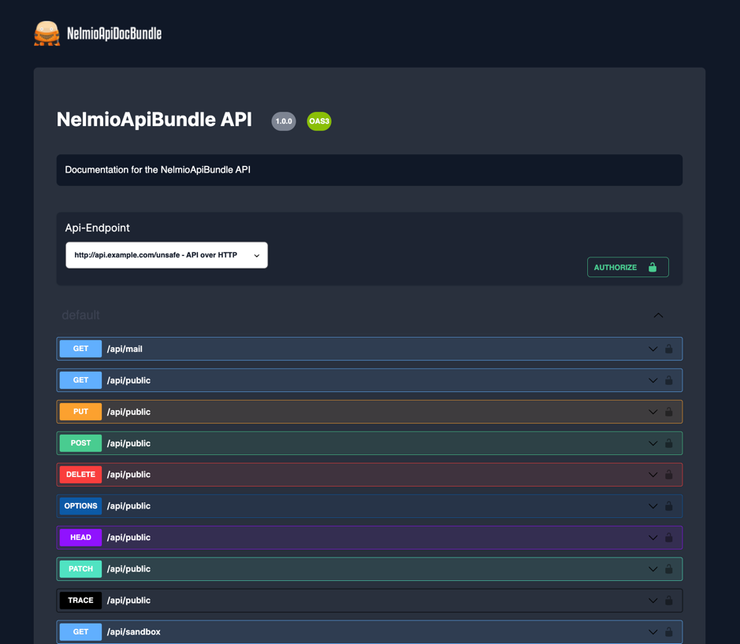

## Dark Theme for NelmioApiDocBundle

# 🌙 Dark Theme for NelmioApiDocBundle

#### 🔗 [GitHub – NelmioApiDocBundle](https://github.com/nelmio/NelmioApiDocBundle)

A sleek and modern dark theme for the Symfony NelmioApiDocBundle documentation — built entirely with CSS and **no JavaScript** required.



---

## 🚀 Installation

Simply copy the `templates/` folder into your Symfony project:

```bash
./templates/
```

That’s it — the theme is now active.

---

## ⚙️ Development

If you want to customize the theme, the following scripts are available:

```bash
npm run build     # Build once
npm run watch     # Watch for changes during development
```

---

## 📦 Production

For production use, include only the minimized CSS file:

```bash
public/swagger-dark.min.css
```

You can link it in your custom NelmioApiDocBundle templates.

---

## 🤝 Contributing

I hope the community will continue to improve and develop this theme further — especially to refine any visual inconsistencies or design weaknesses.

---

## ☕ Support

If you like the project, feel free to support me:

[](https://www.buymeacoffee.com/t96ws8qn2bD)
